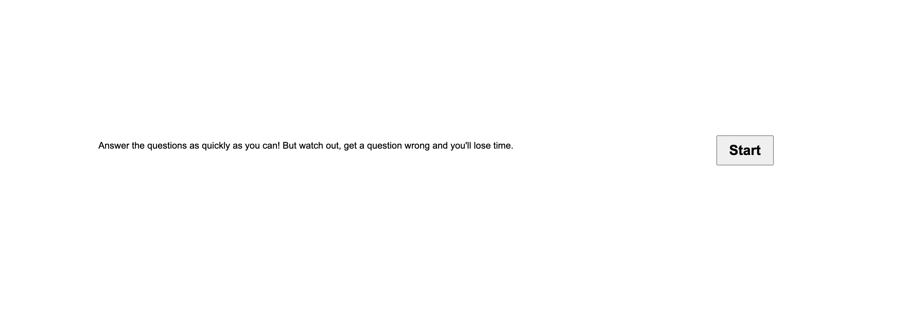

# java_script_game

I've created a javascript quiz that is deployed here: https://adecapite.github.io/java_script_game/

the game is started with a traditional start button 

then you are presented with four multiple choice answers ![alttext] (assests/questions.png)

and finally your time is equal to your score which is saved and submitted at the end screen.